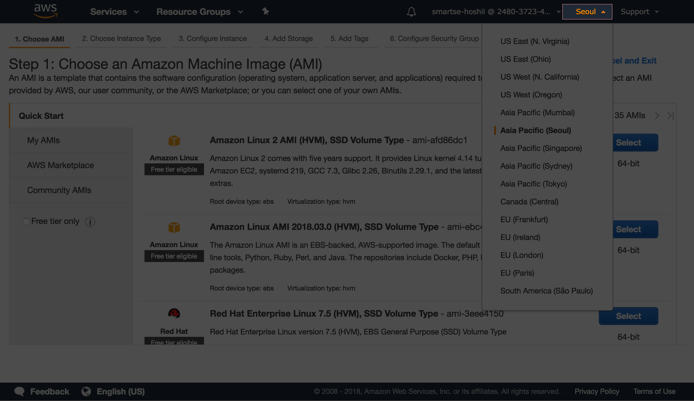
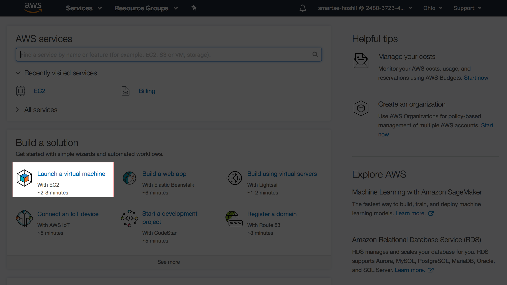
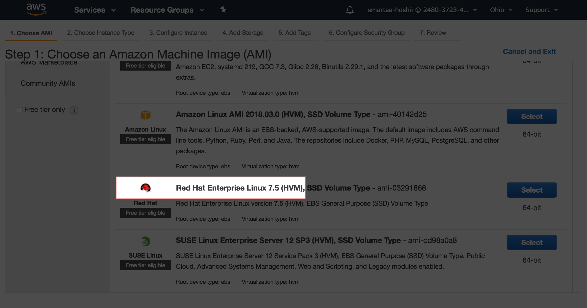
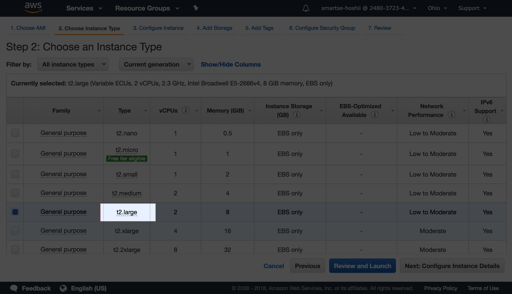
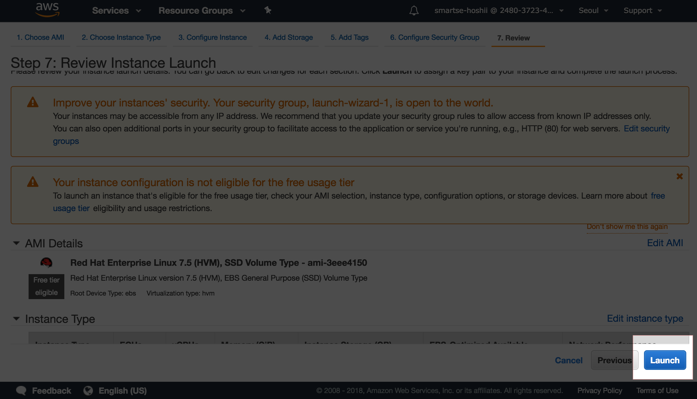
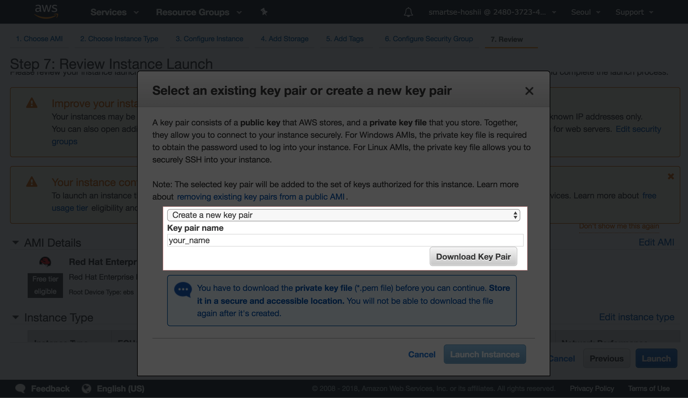
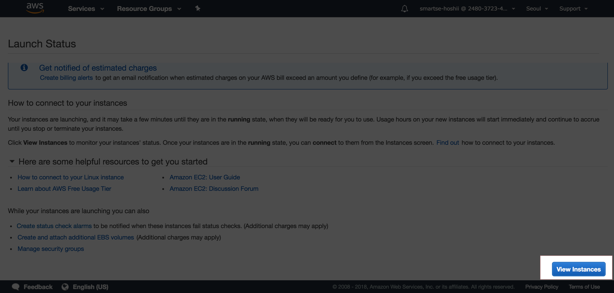
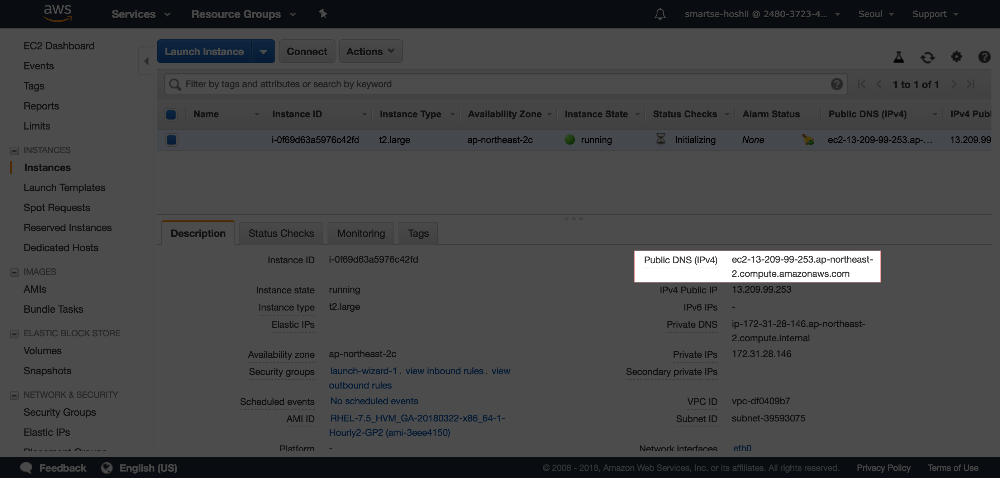

# 演習1
## 1. EC2インスタンス作成

1. AWSに[アクセス](https://248037234963.signin.aws.amazon.com/console)
1. 画面上部のリージョンセレクタで、Asian Pacific(Seoul) を選択する

1. EC2インスタンス作成画面に移動

1. Red Hat Enterprise Linux 7.5 をSELECT

1. インスタンスタイプ `t2.large` にチェックして、 Review and Launch をクリック

1. そのまま Launch をクリック

1. Create a new key pair を選択し、任意のキー名を指定して秘密鍵をダウンロードする

1. Launch Instances をクリック
1. 2~3分待ち、View Instances をクリック

1. stateが running であることを確認して、Public DNS(IPv4)をメモする


## 2. インスタンスにログイン

1. ターミナルを立ち上げ、上で取得した秘密鍵のパーミションを400にする
```aidl
$ mv ~/Downloads/your_name.pem ./
$ chmod 400 your_name.pem
```
1. 秘密鍵、HostKeyAlgorithms, ユーザを指定してログインする
```aidl
$ ssh -i your_name.pem -oHostKeyAlgorithms=+ssh-dss ec2-user@ec2-13-209-99-253.ap-northeast-2.compute.amazonaws.com
```

## 2. Java8、CCMインストール

1. Java8のインストール
```aidl
$ sudo yum install -y java
$ java -version
openjdk version "1.8.0_181"
OpenJDK Runtime Environment (build 1.8.0_181-b13)
OpenJDK 64-Bit Server VM (build 25.181-b13, mixed mode)
```
1. pip のインストール
```aidl
$ curl "https://bootstrap.pypa.io/get-pip.py" -o "get-pip.py"
$ python get-pip.py --user
$ pip -V
pip 18.0 from /home/ec2-user/.local/lib/python2.7/site-packages/pip (python 2.7)
```
1. CCMのインストール
```aidl
$ pip install ccm --user
$ ccm
Missing arguments
Usage:
  ccm <cluster_cmd> [options]
  ccm <node_name> <node_cmd> [options]
...
```

## 3. Cassandra環境構築

1. ノード数3のクラスタ起動用ファイルを作成する（バージョンは2.0.11)
```aidl
$ ccm create -n 3 -v 2.0.11 test
```
1. クラスタを起動する
```aidl
$ ccm start
$  ccm status
Cluster: 'test'
---------------
node1: UP
node3: UP
node2: UP
```

## 4. キースペース、テーブル作成

## 5. トークンレンジの確認
